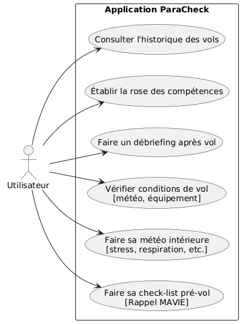

:toc: macro

= Documentation Technique sprint n°1 SAE-5.01-ParaCheck

image::../../img/Paracheck_logo.png[align="center", width=100%]

== Sommaire
toc::[]

== Equipe 2025 - 2026

- link:https://github.com/leonardo-correiamendes[CORREIA MENDES Leonardo] -- Scrum Master / Développeur
- link:https://github.com/Smogita[CRISTINI Aidan] -- Git Master / Product Owner / Développeur
- link:https://github.com/YolanBrun[BRUN Yolan] --  Développeur
- link:https://github.com/Diego-PB[PENICAUD-BERNAL Diego] -- Développeur
- link:https://github.com/marwane-ibrahim[IBRAHIM Marwane] -- Développeur
- link:https://github.com/adrian-guerrero[GUERRERO Adrian] -- Développeur

== Présentation du projet

=== Contexte Général

Le parapente est un sport à risque où la sécurité est importante.
À ce jour, il n’existe pas d’application spécifiquement dédiée à ce besoin.

Un embryon a été initié sur la base d’un PDF utilisé par un moniteur et se trouve ici :
https://github.com/jmbruel/paranote

=== Objectif du Projet

Le projet vise à transformer cet outil en une solution fiable, sécurisée et reconnue officiellement par la Fédération de vol libre, afin d’encourager son adoption par l’ensemble des parapentistes.
Le champ des évolutions possibles est vaste : intégration de données météo en temps réel, analyse des risques, suivi en direct de la position des pilotes, et bien d’autres fonctionnalités.

=== Technologies Utilisées

* **Flutter** : Framework de Google permettant de développer une application unique déployable sur Android, iOS, web et desktop, avec une interface moderne et performante.

* **Dart** : Langage de programmation utilisé par Flutter pour assurer rapidité et fluidité de l’application.

* **GitHub** : Gestion et suivi de projet.

== Cas d'Utilisation Global

* Vérifier l'état du matériel et du parapentiste avant le décollage pour valider la sécurité du vol

** Questionnaire pour valider l'état du matériel

** Questionnaire pour valider l'état du parapentiste

* Entrer ses données de vol

** Formulaire complets pour entrer ses données de vol et les enregistrer

* Historique de vols

** Consulter l’historique des données de vols

== Diagrammes des cas d'utilisation

Celui-ci présente le diagramme des cas d’utilisation de notre projet :

== Présentation des Fichiers Clés et l'arborescence de l'application

----
.
├── .github                               // Configurations GitHub (actions, workflows…)
├── app
│   └── paracheck
│       ├── android                       // Projet Android natif
│       ├── assets                        // Ressources statiques
│       │   ├── fonts                     // Polices utilisées
│       │   │   ├── Poppins-Bold.ttf
│       │   │   └── Poppins-Regular.ttf
│       │   ├── Paracheck_logo.png        // Logo de l'application
│       │   ├── questions_mavie.json      // Fichier de questions (Ma Vie)
│       │   ├── questions_meteo_int.json  // Fichier de questions (Météo interne)
│       │   └── questions_postvol.json    // Fichier de questions (Post-vol)
│       ├── build                         // Fichiers générés par la compilation
│       ├── ios                           // Projet iOS natif
│       └── lib                           // Code source principal (Flutter/Dart)
│           ├── design                    // Gestion du design
│           ├── models                    // Modèles de données
│           ├── pages                     // Pages de l’application
│           │   ├── condition_vol.dart
│           │   ├── flights_history.dart
│           │   ├── home_page.dart
│           │   ├── mavie.dart
│           │   ├── meteo_int.dart
│           │   ├── post_flight_debrief.dart
│           │   ├── respiration_stress.dart
│           │   ├── rose.dart
│           │   ├── splash_screen.dart
│           │   └── uiktdemopage.dart
│           ├── services                  // Services (logique, API…)
│           ├── utils                     // Fonctions utilitaires
│           ├── widgets                   // Composants réutilisables
│           ├── app_router.dart           // Gestion des routes
│           ├── main.dart                 // Point d’entrée de l’application
│           └── theme.dart                // Définition des thèmes
├── test                                  // Tests unitaires / widgets
├── web                                   // Fichiers liés au déploiement web
├── .dart_tool                            // Fichiers internes de Flutter/Dart
├── .flutter-plugins-dependencies         // Dépendances Flutter
├── .gitignore                            // Fichiers/dossiers ignorés par Git
├── .metadata                             // Métadonnées du projet Flutter
├── analysis_options.yaml                 // Configuration de l'analyse statique
├── devtools_options.yaml                 // Configurations DevTools
├── pubspec.lock                          // Version verrouillée des dépendances
├── pubspec.yaml                          // Dépendances et configuration Flutter
├── README.md                             // Documentation principale (Markdown)
├── Documentations                        // Documentation du projet
├── files                                 // Autres fichiers liés au projet
├── img                                   // Images liées à la doc
├── index.html                            // Page HTML (probablement pour le web)
└── README.adoc                           // Documentation principale (AsciiDoc)
----