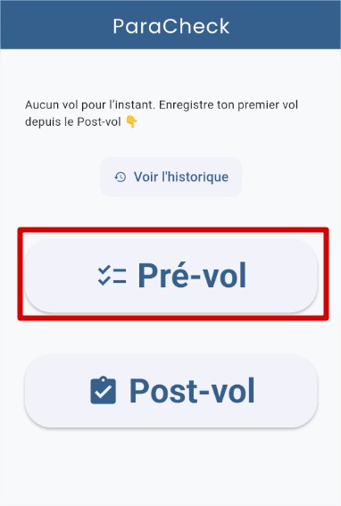
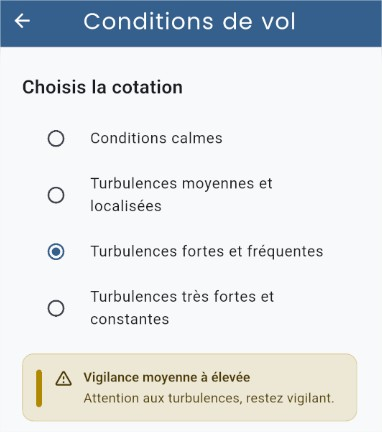
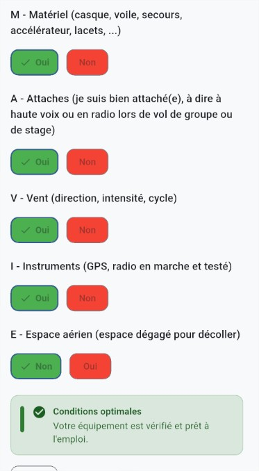
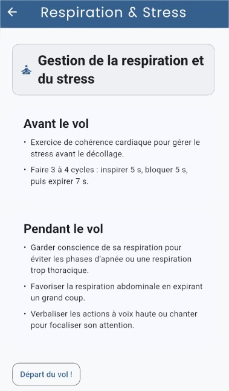
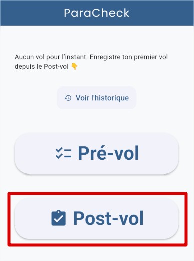
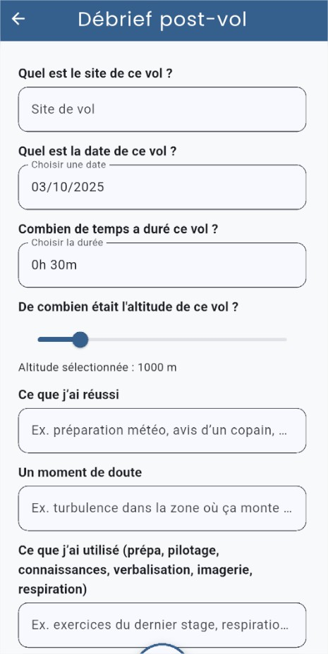
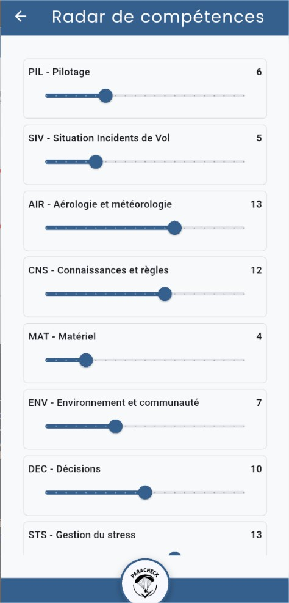
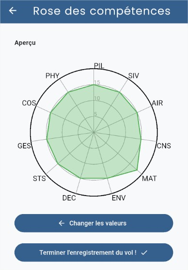
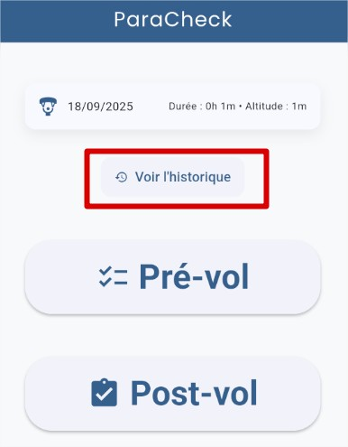

:toc: macro

= Documentation Utilisateur sprint n°1 SAE-5.01-ParaCheck

image::../../img/Paracheck_logo.png[align="center", width=100%]

== Sommaire
toc::[]

== Equipe 2025 - 2026

- link:https://github.com/leonardo-correiamendes[CORREIA MENDES Leonardo] -- Scrum Master / Développeur
- link:https://github.com/Smogita[CRISTINI Aidan] -- Git Master / Product Owner / Développeur
- link:https://github.com/YolanBrun[BRUN Yolan] --  Développeur
- link:https://github.com/Diego-PB[PENICAUD-BERNAL Diego] -- Développeur
- link:https://github.com/marwane-ibrahim[IBRAHIM Marwane] -- Développeur
- link:https://github.com/adrian-guerrero[GUERRERO Adrian] -- Développeur

== Présentation du projet

=== Contexte Général

Le parapente est un sport à risque où la sécurité est importante.
À ce jour, il n’existe pas d’application spécifiquement dédiée à ce besoin.

Un embryon a été initié sur la base d’un PDF utilisé par un moniteur et se trouve ici :
https://github.com/jmbruel/paranote

=== Objectif du Projet

Le projet vise à transformer cet outil en une solution fiable, sécurisée et reconnue officiellement par la Fédération de vol libre, afin d’encourager son adoption par l’ensemble des parapentistes.
Le champ des évolutions possibles est vaste : intégration de données météo en temps réel, analyse des risques, suivi en direct de la position des pilotes, et bien d’autres fonctionnalités.

== Installation

Le guide d'installation est disponible, voici le lien :
link:../guide_installation.adoc[Guide d'installation]

== Fonctionnalités

=== Fonctionnalités principales

==== Vérification de la sécurité avant le vol

===== Vérification des conditions météo (et de vols) par le parapentiste  

===== Questionnaire pour valider l’état physique et mental du pilote  

image::../../img/met_int.jpg[align="center", width=50%]

===== Questionnaire pour valider l’état du matériel  

===== Exercice de respiration et de stress (optionnel) 

 

==== Enregistrement des données de vol

===== Formulaire complet pour saisir les informations relatives au vol (site, météo, type de vol, observations) et les enregistrer 

===== Remplissage et affichage d'une rose de compétences pour suivre son niveau.

==== Consultation de l’historique des vols 

===== Accéder à l’historique des vols précédents pour analyser les données et les incidents éventuels  

image::../../img/test_histo.jpg[align="center", width=50%]

=== Fonctionnalités secondaires

* **Gestion des données de vol** : Les pilotes peuvent enregistrer et consulter les informations relatives à leurs vols, incluant les conditions météo, le type de site et les observations de sécurité.  
* **Analyse des risques** : L’application propose des évaluations de risques basées sur les paramètres du vol et les conditions locales, afin d’aider les parapentistes à prendre des décisions éclairées.  
* **Suivi en temps réel** : Possibilité de suivre la position d’un pilote pendant le vol grâce à l’intégration de données GPS.

L’objectif principal est de fournir une interface claire et fiable pour que les parapentistes puissent planifier leurs vols, suivre leur activité et réduire les risques liés à la pratique du parapente.