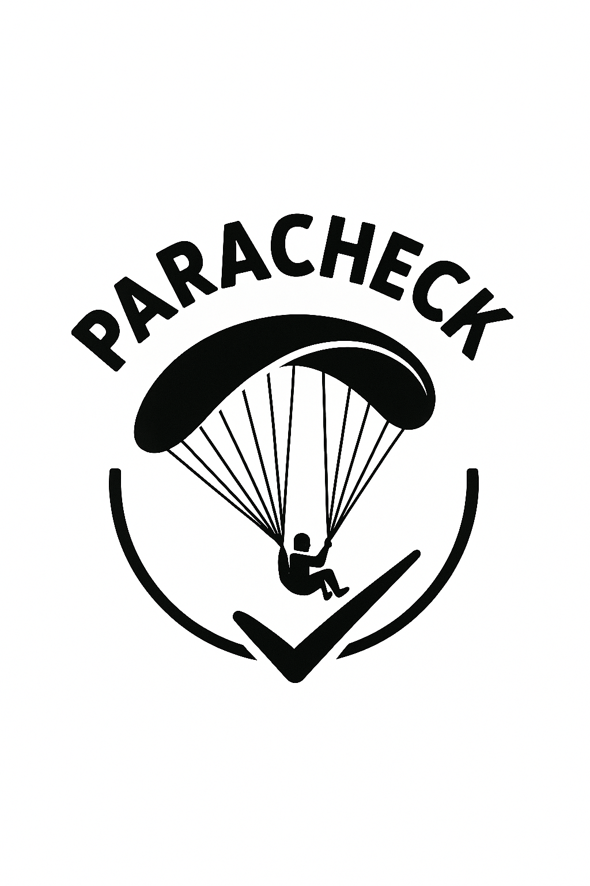

= ParaCheck 

:toc: macro

== Sommaire :

toc::[]

== Projet : 

Le parapente est un sport à risque où la sécurité est importante.
Il n’existe pas d’application dédiée.

Un embryon a été initié l’an dernier sur la base d’un PDF utilisé par un moniteur et se trouve ici :
https://github.com/jmbruel/paranote

L’idée est de rendre cet outil robuste, sûr et validé par la fédération de vol libre pour inciter tous les parapentistes à l’utiliser.
Pour ce sujet, il y a énormément d’ouvertures et d’extensions possibles (prise en compte de la météo en temps réel, analyse de risques, suivi en temps réel de la position, …).

== Equipe :

Projet réalisé par::

- link:https://github.com/leonardo-correiamendes[CORREIA MENDES Leonardo] -- Scrum Master / Développeur
- link:https://github.com/Smogita[CRISTINI Aidan] -- Git Master / Product Owner / Développeur
- link:https://github.com/YolanBrun[BRUN Yolan] --  Développeur
- link:https://github.com/Diego-PB[PENICAUD-BERNAL Diego] -- Développeur
- link:https://github.com/marwane-ibrahim[IBRAHIM Marwane] -- Développeur
- link:https://github.com/adrian-guerrero[GUERRERO Adrian] -- Développeur

NOTE: Sur une idée originale et une link:files/carnetA4.pdf[fiche existante]. Et avec l'aide des étudiants suivants avant SAE : https://github.com/enzofrnt[Enzo], ...

== Client

Jean-Michel Bruel (jean-michel.bruel@univ-tlse2.fr / jbruel@gmail.com)

== Version en ligne

Outil de check pré/post vol. 
La version en ligne est disponible ici : https://bit.ly/paranote.
